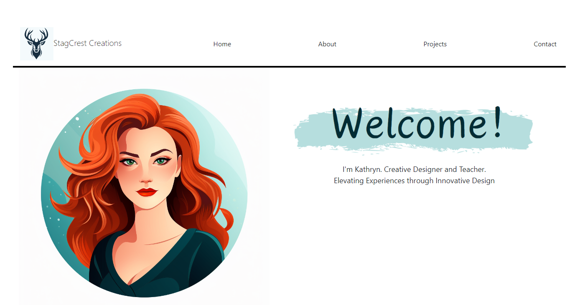

# Kathryn-Dougherty-Portfolio

## Description

Welcome to my portfolio. Here you can explore my skills and talents through current projects.

👋 To future employers: This website and included projects were built during an intensive UCF Coding Bootcamp (Sept-Dec 2023). If this is what I can accomplish in only 3-months, imagine the potential that awaits your company.

👋 To friends, family, and explorers: I'm open for feedback, questions, and collaboration!

## Table of Contents

- [Installation](#installation)
- [Usage](#usage)
- [Credits](#credits)

## Installation

1. Use the command line

        npm install
        npm run start

## Usage

Explore and Reach Out!

## Credits

Project created by Kathryn Dougherty with instruction from the UCF Coding Bootcamp.
